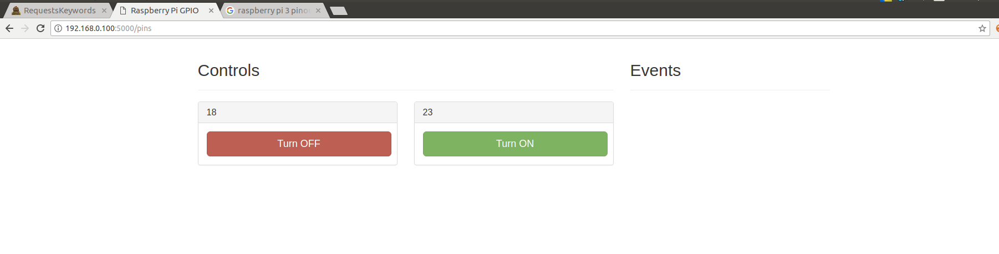
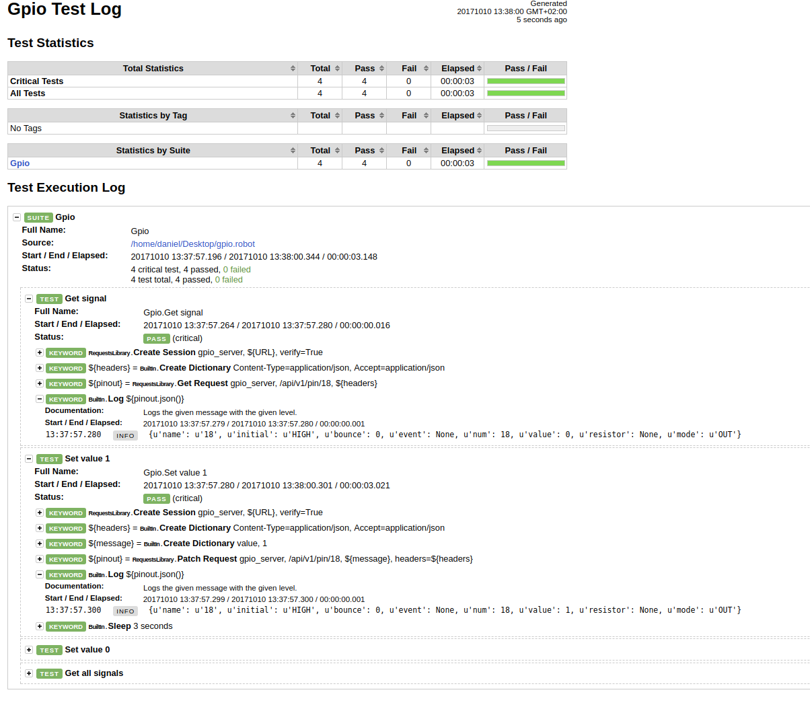

# Robot Framework - using Request library for control RPI GPIO's

Requests library is one of the most popular libraries implemented for Robot
framework. It is very important for testing scattered applications, so this is
the first library I got to know in the robot framework. The library requires 
installing `robotframework-requests` and `requests` for proper working. 
`Collections` library is a standard built-in library.

For checking `Request` library we can install Pi-GPIO-Server on Raspberry Pi.
Server is able to control state of input and output of GPIOS using Rest API.

Project is availiable on link: [Project weekend - GPIO Server](https://github.com/projectweekend/Pi-GPIO-Server)

In the Rest Api we use methods:
- Delete
- Get
- Options
- Post
- Put
- Patch

For control GPIO's on the RPI we need only `Get` and `Patch`, other methods are
used in the same way - `Options` are exceptions.

I assume you have already installed Robot Framework. If response is "NO",
I would like you to invite the paragraph [Installation paragraph](http://robotframework.org/robotframework/latest/RobotFrameworkUserGuide.html#installation-instructions)
It is official documentation for Robot Framework. Next we can install libraries.

Use below commands to install libs:

```
apt-get install python-pip
pip install -U requests
pip install -U robotframework-requests
```

Now we can prepare RPI image. Install `RASPBIAN STRETCH WITH DESKTOP`. It is
very good solution, because we can controll also GPIO's using buttons.



I hope that instruction of installation process is exact, so I will not duplicate
the description. Take a few minutes for preparation of configurations for pins
and restart gpio server:

```
sudo service gpio-server restart
```

For running server go to Pi-GPIO-Server and type:

```
python pi_gpio_server.py
```

Now, we can start writting code for control GPIO using Rest API and Robot framework.

```
*** Settings ***

*** Variables ***

*** Test Cases ***

*** Keywords ***
```

Run RPi and check its IP address. We will use IP for connection with API server.
My RPI has IP: 192.168.0.46. Documentation says that server runs on `5000` port. 
So we can prepare URL variable. On `Variables` section type:

```
${URL} http://192.168.0.46:5000
```

Let's test out first test `Get signals`. Firstly  we should create session 
for request control in Robot Framework. This convention uses all
libraries eg. SSH.

For create session we use keyword `Create session` with parameters `alias`, `URl`
and optional `verify`.

```
*** Test Cases ***

Get signal
Create Session gpio_server ${URL} verify=True
```

We will use `alias` for all keywords which work on URL. All sessions should be
closed using keyword `Delete All Sessions`.
Next we need header, which should be send with request. One of the methods for creating
header looks like:

```
Create Dictionary Content-Type=application/json Accept=application/json
```

Good trick is assigning headers to variable. For checking value of GPIO is prepared
GET method. Documentation tells:

```
Read a single pin

GET: /api/v1/pin/:num
```

Let's implement it in another way:

```
${pin}= Get Request gpio_server /api/v1/pin/18 ${headers}
```

As I said, `alias` is very important. Unfortunatelly for observing results
Robot Framework has special keyword. Its name is `Log`.

Whole test look like this:

```
*** Settings ***
Library RequestsLibrary
Library Collections


*** Variables ***
${URL} http://192.168.0.46:5000


*** Test Cases ***

Get signal
Create Session gpio_server ${URL} verify=True
${headers}= Create Dictionary Content-Type=application/json Accept=application/json
${pin}= Get Request gpio_server /api/v1/pin/18 ${headers}
Log  ${pin.json()}
Delete All Sessions
```

For getting all signals you can only delete number of pin on hyperlink.
Example:

```
Get signals
Create Session gpio_server ${URL} verify=True
${headers}= Create Dictionary Content-Type=application/json Accept=application/json
${pinout}= Get Request gpio_server /api/v1/pin ${headers}
Log ${pinout.json()}
```

That was easier part of our script.

To set values for GPIO's is designed patch method.
First step is creating dictionary with value to send. It is not difficult:
```
${message}= Create Dictionary value 0
```

`Patch` request requires message data for send.

```
Set 0 signals
Create Session gpio_server ${URL} verify=True
${headers}= Create Dictionary Content-Type=application/json Accept=application/json
${message}= Create Dictionary value 0
${pin}= Patch Request gpio_server /api/v1/pin/18 ${message} headers=${headers}
Log ${pin.json()}
Delete All Sessions
```

The same test we can use for setting high values on GPIO. (?)For indicator I used LED
diodes connected serial with resistors.

Full version of my code

```
*** Settings ***
Library RequestsLibrary
Library Collections


*** Variables ***
${URL} http://192.168.0.100:5000

*** Test Cases ***

Get signal
Create Session gpio_server ${URL} verify=True
${headers}= Create Dictionary Content-Type=application/json Accept=application/json
${pinout}= Get Request gpio_server /api/v1/pin/18 ${headers}
Log ${pinout.json()}

Set value 1
Create Session gpio_server ${URL} verify=True
${headers}= Create Dictionary Content-Type=application/json Accept=application/json
${message}= Create Dictionary value 1
${pinout}= Patch Request gpio_server /api/v1/pin/18 ${message} headers=${headers}
Log ${pinout.json()}
Sleep 3 seconds

Set value 0
Create Session gpio_server ${URL} verify=True
${headers}= Create Dictionary Content-Type=application/json Accept=application/json
${message}= Create Dictionary value 0
${pinout}= Patch Request gpio_server /api/v1/pin/18 ${message} headers=${headers}
Log ${pinout.json()}

Get all signals
Create Session gpio_server ${URL} verify=True
${headers}= Create Dictionary Content-Type=application/json Accept=application/json
${pinout}= Get Request gpio_server /api/v1/pin ${headers}
Log ${pinout.json()}
```

This code hasn't got ideal form but it is not subject of this article.
After all tests RF generates very readable reports.

Reports look like this:


You can see that Robot Framework is very easy to use environment for testing REST
API. All method (e.g. POST and Patch) are the same in using. If you need
help with implementing tests you can ask me or chat with users on slack - request
channel, when sometimes I help new users or also I am looking for help.